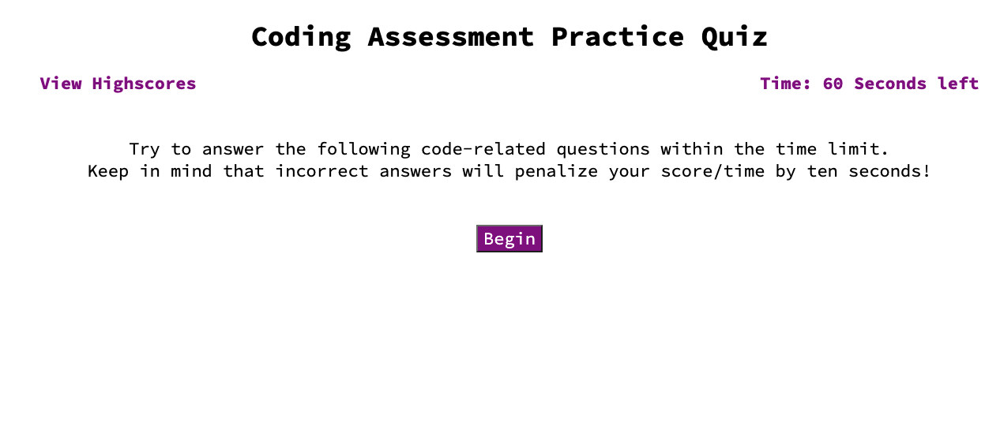

# Coding-Assessment-Practice

## This was created in order to allow aspiring software engineers practice their coding assessment skills in order to prepare for the technical portion of interviews. By working on this project, I have learned how to utilize local storage, addending/removing HTML elements via jQuery, and how to utilize timers.

## Links
- https://github.com/bburton5/Coding-Assessment-Practice
- https://bburton5.github.io/Coding-Assessment-Practice/

## Usage
This webpage can be used to review skill-based questions when preparing for interviews, which can increase amount of job offers a person gets.

## Credits
- StackOverflow
- MDN
- w3schools